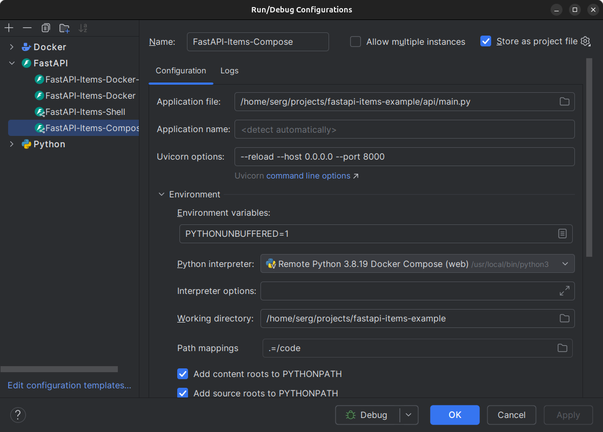

## Debugging via PyCharm 2024.1

### PyCharm's configuration:


Configuration file: [.run/UvicornServer.run.xml](.run/UvicornServer.run.xml)
Docker Compose file: [docker-compose.yaml](docker-compose.yaml)

Press `Ctrl`+`F9` to run debugger

### PyCharm imposes a number of restrictions

1. There is no way to rename the file: `docker-compose.yaml`
2. PyCharm automatically override Docker Compose file

* your service `web` will be overridden
* working dir will be `/opt/project` (I did not find the way to leave `/code`)

```shell
$ docker compose ls
NAME                        STATUS              CONFIG FILES
fastapi-items-example       running(2)          /home/serg/projects/fastapi-items-example/docker-compose.yaml,/home/serg/.cache/JetBrains/PyCharm2024.1/tmp/docker_compose/docker-compose.override.2179.yml
```